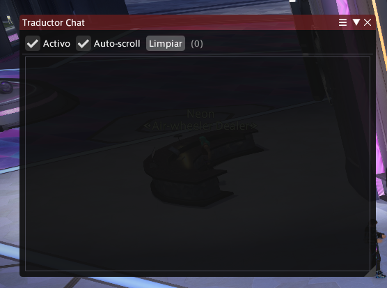
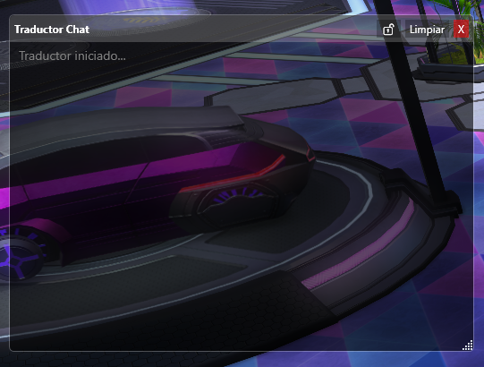
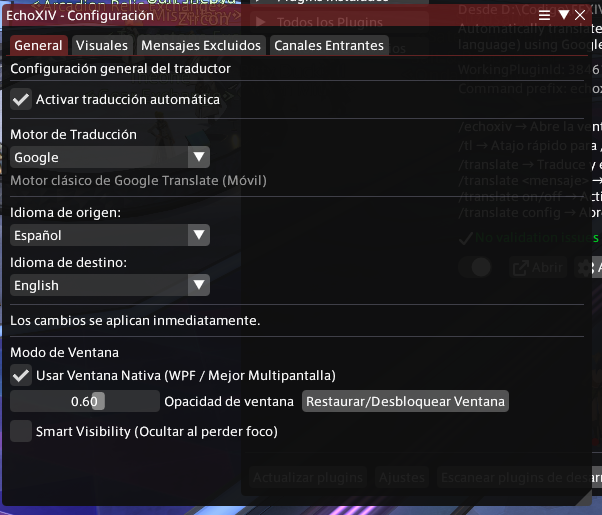

#  EchoXIV 🌸 

**EchoXIV** es un plugin avanzado para XIVLauncher/Dalamud diseñado para romper las barreras del idioma en FFXIV. A diferencia de otros traductores, EchoXIV se enfoca en la **comunicación activa**: permitiéndote ser entendido en cualquier idioma de forma fluida y natural.

## 🌟 Características Principales

- **Tu Mensaje en Cualquier Idioma (Outgoing Translation)**: Usa el comando `/tl <mensaje>` para enviar una traducción instantánea al canal activo.
- **Traducción Bidireccional**: Entiende lo que dicen y asegúrate de que te entiendan.
- **Detección Dinámica de Canales**: El sistema detecta automáticamente si estás en Party, FC, Say o en un Tell privado.
- **Superposición Nativa (WPF)**: Una ventana elegante y fluida que se integra perfectamente con el juego.
- **Visibilidad Inteligente (Smart Visibility)**: El plugin se oculta automáticamente basándose en el foco del proceso del juego, cinemáticas y pantallas de carga.
- **Experiencia Inicial**: Configuración automática basada en el idioma de tu Dalamud y una pantalla de bienvenida guiada.
- **Privacidad y Simplicidad**: Soporte para **Google Translate** (sin API key) y **Papago** para una traducción rápida y confiable.

### 🖥️ Comparativa de Modos de Ventana

| Característica  | Ventana Interna (ImGui)                 | Ventana Nativa (WPF)               |
| :-------------- | :-------------------------------------- | :--------------------------------- |
| **Integración** | Total (dentro del juego)                | Ventana flotante independiente     |
| **Rendimiento** | Puede afectar FPS en monitores externos | **Sin impacto en FPS del juego**   |
| **Uso Ideal**   | Un solo monitor / Modo inmersivo        | Multi-monitor / Máximo rendimiento |
| **Tecnología**  | Dalamud WindowSystem                    | .NET WPF (Nativo Windows)          |

## 📷 Capturas de Pantalla

|           Ventana Interna (ImGui)            |              Ventana Nativa (WPF)              |
| :------------------------------------------: | :--------------------------------------------: |
|  |  |

|            Configuración             |
| :----------------------------------: |
|  |

## 🚀 Instalación

Actualmente EchoXIV se encuentra en proceso de revisión para el repositorio oficial de Dalamud.

### Instalación vía Testing (Pronto)

Una vez sea aceptado en el canal de pruebas:

1. Abre el instalador de plugins de **Dalamud** (`/xlplugins`).
2. Ve a **Settings**.
3. Asegúrate de tener activa la opción **"Get plugin testing updates"**.
4. Busca **EchoXIV** en la lista e instálalo.

## 📖 Comandos

| Comando         | Descripción                                        |
| --------------- | -------------------------------------------------- |
| `/echoxiv`      | Abre la ventana de configuración.                  |
| `/tl <mensaje>` | Traduce y envía el mensaje al canal activo actual. |
| `/tl config`    | Acceso rápido a las opciones.                      |

## 🔧 Configuración

Accede al menú con `/echoxiv`:

- **Bienvenida**: Pantalla inicial para configurar tus idiomas en segundos.
- **General**: Configura tus idiomas de origen y destino.
- **Visuales**: Ajusta la opacidad, el bloqueo de ventana y el modo "Smart Visibility".
- **Filtros**: Excluye mensajes o canales que no desees traducir. Incluye una lista maestra de jerga de juego (P1-P4, Job names, etc.).

## 🙏 Agradecimientos

- **TataruHelper**: Por la inspiración técnica en el método de traducción.
- **Echoglossian**: Por las referencias en la integración con Dalamud.
- **Dalamud/XIVLauncher**: Por el increíble ecosistema de desarrollo.

---

**Nota**: Este plugin es una herramienta de terceros. Úsalo con responsabilidad y respeta los términos de servicio de Square Enix.
