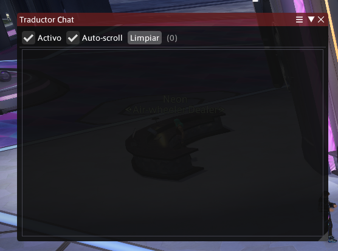
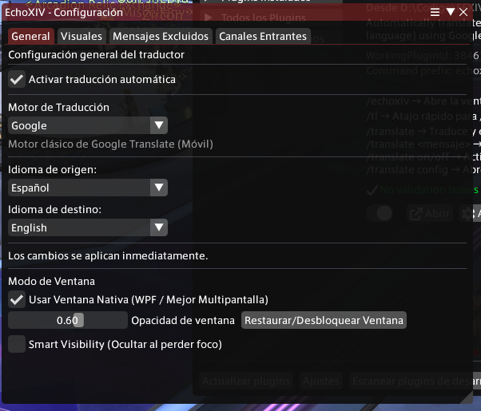

#  EchoXIV 🌸 

**EchoXIV** is an advanced XIVLauncher/Dalamud plugin built to reduce language barriers in FFXIV. Unlike passive translators, EchoXIV focuses on **active communication**, helping you understand others and be understood naturally in different languages.

## 🌟 Key Features

- **Your Message in Any Language (Outgoing Translation)**: Use `/tl <message>` to send an instant translation to the active chat channel.
- **Bidirectional Translation**: Understand what others say and make sure they understand you.
- **Dynamic Channel Detection**: Automatically detects whether you are chatting in Party, FC, Say, or a private Tell.
- **Integrated Dalamud Window**: Displays translated chat inside the native Dalamud UI using ImGui.
- **Localized UI**: Follows the language configured in Dalamud, including expanded support for the UI languages supported by Dalamud.
- **Smooth First-Run Experience**: Initial setup is based on your Dalamud language, with a guided welcome screen.
- **Privacy and Simplicity**: Supports **Google Translate** without an API key and **Papago** for fast, practical translation.

## 📷 Screenshots

|          Integrated Translated Chat           |
| :-------------------------------------------: |
|   |

|             Configuration             |
| :-----------------------------------: |
|  |

## 🚀 Installation

EchoXIV is currently intended for distribution through the Dalamud ecosystem and repository workflow.

### Testing Channel Installation

Once it is available in the testing channel:

1. Open the **Dalamud** plugin installer with `/xlplugins`.
2. Go to **Settings**.
3. Make sure **Get plugin testing updates** is enabled.
4. Search for **EchoXIV** in the plugin list and install it.

## 📖 Commands

| Command        | Description                                      |
| -------------- | ------------------------------------------------ |
| `/echoxiv`     | Opens the configuration window.                  |
| `/tl <message>`| Translates and sends the message to the active channel. |
| `/tl config`   | Shortcut to open the settings.                   |

## 🔧 Configuration

Open the menu with `/echoxiv`:

- **Welcome**: Initial screen to configure your languages in seconds.
- **General**: Set your writing and target languages.
- **Visuals**: Adjust font size, time format, per-channel colors, and translated chat window locking.
- **Filters**: Exclude messages or channels you do not want translated, including common game shorthand and recurring terms.

## 🙏 Credits

- **TataruHelper**: Technical inspiration for the translation approach.
- **Echoglossian**: Useful references for Dalamud integration.
- **Dalamud/XIVLauncher**: For the development ecosystem that makes plugins like this possible.

---

**Note**: This plugin is a third-party tool. Use it responsibly and respect Square Enix's terms of service.
